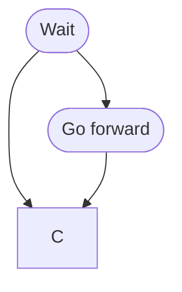

1. ~~Hey~~ Wake word 
1. **Go forward**
1. **Grab water bottle**
1. Grab pencil
1. Grab pen
1. **Turn left**
1. **Turn right**
1. Magnet on
1. Magnet off
1. Goodnight Neato
1. **Go backwards**
1. **Spin**
1. **Follow me**
1. Stop
1. How are you
1. Good work
1. Grab tool
1. Grab drink
1. Grab food
1. Return